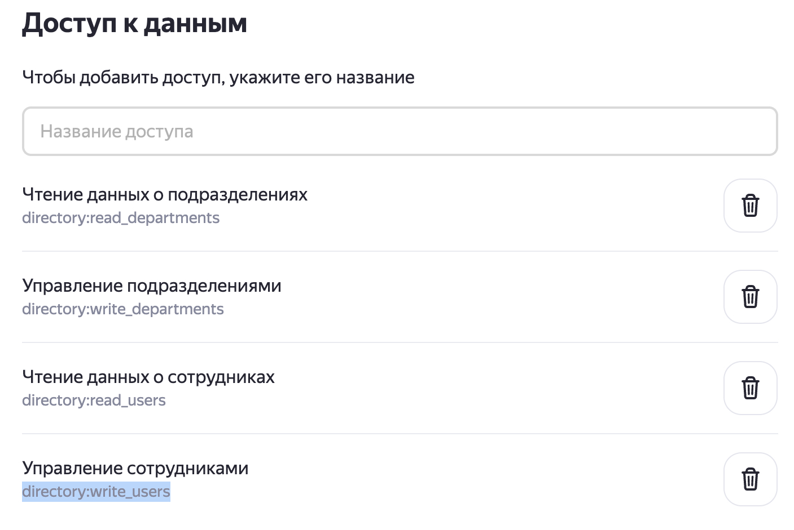
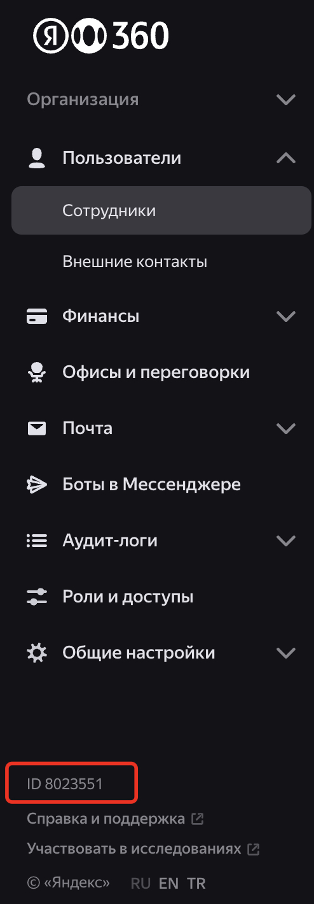

# Описание модуля 
При выполнении задач управления настройками ораганизации Яндекс 360 администратор часто сталкивается с необходимостью выполнять часть настроек через вызовы HTTP API функций с соответствующими параметрами (ссылка на документацию доступных API вызовов - [API Яндекс 360 для бизнеса](https://yandex.ru/dev/api360/))

Данный модуль преданазначен для автоматизации некоторых сложных задач, которые можно выполнить только через API запросы.
В модуле используются наработки моих коллег - архитекторов Яндекс 360, которые в разное время создавали свои скрипты под выделенные задачи.
Возможности модуля предполагается со временем расширять для того, чтобы в одном месте собрать функционал для реализации различных задач.

На текущий момент времени модуль состоит из одного скрипта - `y360utils.py`, работать с которым предполагается в интерактивном режиме (при запуске показывается текстовое меню), где требуется взаимодействие с пользователем, в том числе, подтверждение его соглачия на выполнение действий с организацией Яндекс 360.

## Запуск скрипта ##
Для запуска скрипта используется команда `python y360_utils.py`

## Конфигурационные параметры скрипта ##
Конфигурационные параметры для работы срипта прописываются в файле `.env`. В коде для чтения данных из этого файла используется библиотека python-dotenv.
| Параметр | Описание |
|---------|------|
|access_token|OAuth токен для доступа к API 360 ([как получить](#Подготовка-к-работе))|
|orgId|ID организации 360 ([как получить](#Подготовка-к-работе))|
|DEPS_FILE_NAME|Имя файла загрузки списка создаваемых подразделений|
|DEPS_BACKUP_FILE|Имя файла для выгрузки существующих подразделений|
|DEPS_UNUSED_FILE|Имя файла для загрузки/выгрузки удаляемых/неиспользуемых подразделений|


## Реализованные функции модуля
Ниже представлено краткое описание текущего функционала скрипта`y360utils.py`. Более подробные сведения представлены ниже в описании.

### Запускаемый файл - *y360utils.py*
| Пункт меню | Описание |
|------------|----------|
|1. Delete all departments and create them from file ([описание](#1-delete-all-departments-and-create-them-from-file)).| Удаляет все подразделения из организации Яндекс 360 и создаёт новые из файла | 
|2. Update departments from file ([описание](#2-update-departments-from-file)).| Сохраняет текущию структуру подразделений и добавляет новые из файла (**отсутствующие в файле подразделения не удаляются из Я360**) | 
|3. Export existing departments to file ([описание](#3-export-existing-departments-to-file)).| Сохранение текущей иерархии подразделений в файл (можно использовать для бэкапа) | 
|4. Export unused departments to file ([описание](#4-export-unused-departments-to-file)). | Поиск неиспользуемых департаментов в Я360 (в качестве основы для сравнения используется входной файл с актуальным списком подразделений)|
|5. Delete unused departments ([описание](#5-delete-unused-departments)).| Удаление выделенных подразделений из Я360 (используется файл со списком удаляемых подразделений)|
|6. Delete all departments ([описание](#6-delete-all-departments)).| Удаление всех подразделений из организации Я360|

## Подготовка к работе

> \[!WARNING\]  
> Далее все рекомендации по установке и настройке среды описваются для последней версии Python (протестировано на 3.12.4). Если у вас другая версия, поступайте в соответствии с вашей конфигурацией.

1. Необходимо установить исполняемую среду Python ([Download Python](https://www.python.org/downloads/))

2. (Опциоанально) Использовать виртуальную среду для работы программы. Для этого:
    * В коммандной строке установите инструмент создания виртуальной среды - `$ pip install virtualenv`
    * Переходим в каталог, где находится скрипт для запуска, и выполняем команду создания каталога для поддержки вирутальный среды Python для этого проекта - `python3 -m venv virtenv`. Это создаст в текущем каталоге новый каталог `virtenv` со своей служебной структурой.
    * Перед запуском скрипта необходимо активировать виртуальную среду для его выполнения. Для этого выполняем команду:
        - в MacOS, Linux - `source virtnv/bin/activate`
        - в Windows - в каталоге `env\Scripts` есть несколько файлов:
            - `activate.ps1` - для активации через Powershell;
            - `activate.bat` - для активации через CMD.
    * После выполнения программы для выхода из вигруального окружения нужно:
        * в MacOS выполнить команду `deactivate`
        * В Windows выполнить команду `virtenv\Scripts\deactivate.bat`

3. Один раз (если устанавливали вирутальную среду, то после ее  активации) выполнить установку пакетов, необходимых для работы скрипта - `pip install -r requirements.txt`

4. Создать OAuth токен для аутентификации в API Яндекс 360. Токен должен содержать необходимые права для выполения операций управления ресурсами в организации Яндекс 360. Документация - [Создание приложения](https://yandex.ru/dev/id/doc/ru/register-client). Последовательность шагов для создания токена:
    * заходим на https://oauth.yandex.ru/client/new/. Аутентифицируемся от имени администратора организации Яндекс 360.
    * Заполняем поля в форме создания приложения:
        - Поле "Название вашего сервиса" - произвольное название.
        - Включаем галочку "Веб сервисы"
        - В поле `Redirect URL` вводим `https://oauth.yandex.ru/verification_code`
        - В разделе "Почта для связи" указываем свой email.
          
        
        
    * Добавляем разрешения для токена. Для этого в разделе "Доступ к данным" ищем и добавляем следующие разрешения:
        | Имя разрешения | Что можно делать |
        |----------------|----------|
        | directory:read_departments | читать информацию о  подразделениях |
        | directory:write_departments | изменять информацию о подразделениях |
        | directory:read_users |  читать информацию о пользователях |
        | directory:write_users | изменять информацию о пользователях |
        
        
        
    * нажимаем на кнопку "Создать приложение".
    * Свойства созданного приложения отображаются в новом окне "Мои приложения". Ищем раздел с идентификатором созданного приложения и копируем строку из поля "ClientID":
      
        
        
    * В текстовом редакторе созадем строку вида `https://oauth.yandex.ru/authorize?response_type=token&client_id=<идентификатор приложения>` и вставляем в ней вместо `<идентификатор приложения>` скопированное значение ClientID из предыдущего пункта. 
    Вставляем получившуюся ссылку в браузер и нажимаем "Enter".
    * В окне браузера появляется запрос на подтверждение прав токена. Подтверждение **необходимо выполнить от учётной записи администратора организации** (если это сделать от имени обычного пользователя, то токен не получит затребованных прав из-за отсутствия необходимых разрешений у данной пользовательской учётной записи).
    Нажимаем "Войти как" и получаем необходимый токен доступа. 
    > [!WARNING]  
    > Копируем токен и сохраняем в надёжном месте.

5. Получить ID организации в Яндекс 360. Для этого необходимо зайти в [консоль администрирования](admin.yandex.ru) и в левом нижнем углу интерфейса будет необходимый номер.
   
   
        
7. Записываем полученные на предыдущем шаге OAuth токен и Org ID в соответствующие переменные в файле файле `.env` в том же каталоге, что и сами скрипты. Эта информация нужна для правильной аутентификации скриптов в API Яндекс 360.

## Тестовые файлы, которые используются в качестве входных и выходных данных ##

#### Файл описания подразделения `deps_list.csv`
Файл используется для описания подразделений ораганизации, которые планируется импортировать в организацию Яндекс 360. Также эта структура используется при экспорте существующих подразделений из Яндекс 360.
Формат:
```
1;Yandry Corp;ИТ
3;Barb Corp;ИТ
7;Yandry Corp;Дирекция
5;Barb Corp;ИТ;Отдел сопровождения
20;Yandry Corp;ИТ;Отдел внедрения
```
Первый столбец:
 - при импорте подразделений - произвольный уникальный номер;
 - при экспорте подразделений - идентификатор подразделения в ресурсной модели Яндекс 360;

Последующие столбцы - описание цепочки подразделений от верхнего уровня до последнего через точку с запятой.

Прописывать в отдельной строке каждое подразделение необязательно, достаточно, например, указать так:
```
5;Barb Corp;ИТ;Отдел сопровождения
20;Yandry Corp;ИТ;Отдел внедрения
```
и будет создана вся необходимая иерархия. 
Но, в случае создания подразделений и одновременной привязки пользователя к ним, каждое из них, где будут привязаны пользователи, должно иметь отдельную строку при импорте из файла. 
Например, если к подразделению `Yandry Corp;ИТ` будут привязаны пользователи, такая строка должна быть в файле импорта.

#### Файл описания подразделения `deps_unused.csv`
Файл используется для описания подразделений, которые должны быть удалены из организации Я360. Структура файла такая же, как и для файла `deps_list.csv`

## Запуск срипта ##
Для запуска скрипта используется команда `python y360_utils.py`

## Краткое описание работы различных опций скрипта ##

#### 1. Delete all departments and create them from file. #### 

- Скрипт берет список подразделений из файла `deps_list.csv`.
- Происходит отвязка существующих пользователей от подразделений, к которым они прикреплены (один пользватель <-> одно подразделение). Все сотрудники перемещаются в подразделение `Все сотрудники`.
- Скрипт удаляет все подразделения в организации Я360.
- Создаются новые подразделения по списку в файле `deps_list.csv`.

#### 2. Update departments from file. ####
- Скрипт берет список подразделений из файла`deps_list.csv`. 
- Скрипт проходится по списку и проверяет, существует ли очередное подразделение в ораганизации Я360. Если нет, то скрипт добавляет это подразделение в организацию. Если подразделение существует, то скрипт ничего с ним не делает.
Если подразделение существует в орге Я360, но отсутствует в файле, то ничего не происходит (подразделение остаётся в орге Я360).

#### 3. Export existing departments to file. ####
- Скрипт читает список подразделений из орги Я360 и создаёт файл `deps_list_<метка_времени>.csv` в таком же формате, как и оригинальный файл `deps_list.csv`. 
При этом число в первой колонке каждой строки указывает на номер подразделения в ресурсной модели орги Я360.
Данную команду можно использвать как возможность быстро проверить список подразделений, а также выполнить их бэкап.

#### 4. Export unused departments to file. ####
- Скрипт берет список подразделений из файла `deps_list.csv` и использует этот список как шаблон для поиска подразделений, которых нет в этом шаблоне.
- Скрипт читает список подразделений из орги Я360 и сравнивает каждое подразделение с исходным списокм. Если подразделения нет в исходном списке, оно помещается в файл `deps_unused_<метка_времени>.csv`. 
При этом число в первой колонке каждой строки указывает на номер подразделения в ресурсной модели орги Я360. 
Далее информацию из этого файла можно использовать для удаления ненужных подразделений.

#### 5. Delete unused departments. ####
- Скрипт берет список подразделений из файла `deps_unused.csv`.
- Скрипт ищет указанные подразделения в организации Я360, отвязывает от них пользователей (они попадают в поразделение `Все сотрудники`) и удаляет подразделение.
Если удаляемое подразделение содержит подчинённую иерархию подразделений, то предварительно удаляются подразделения в этой иерархии.

#### 6. Delete all departments. ####
- Скрипт производит отвязку существующих пользователей от всех подразделений, к которым они прикреплены (один пользватель <-> одно подразделение). Все сотрудники перемещаются в подразделение `Все сотрудники`.
- Скрипт удаляет все подразделения в организации Я360.


