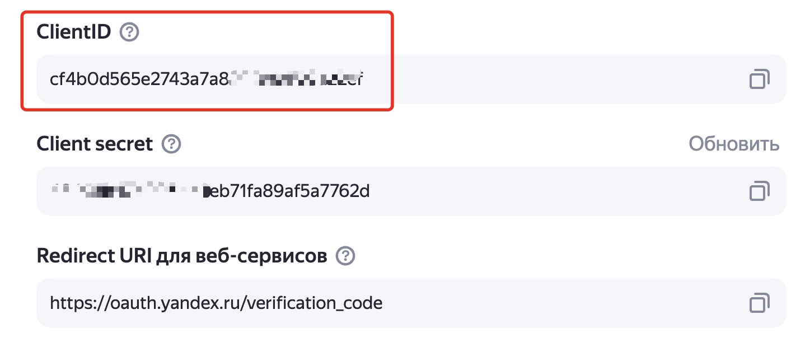

# Описание модуля 
Модуль предназанчен для централизованной массовой загрузки аватарок пользователей в сервисе Яндекс 360 из заранее подготовленного каталога с фотографиями.
Для удобства работы в библиотеке есть два PowerShell скрипта для работы с фотографиями пользователей в MS Active Directory - для их загрузки и выгрузки из атрибута thumbnailPhoto.
При загрузке фотографии в Яндекс 360 используется API вызов [Загрузить портрет](https://yandex.ru/dev/api360/doc/ru/ref/UserService/UserService_UpdateAvatar).
> [!WARNING]  
> На страничке с описанием параметров вызова API для загрузки портрета в настоящий момент времени есть ошибка в параметрах вызова команды curl. Правильный набор параметров (вместо --data нужно указывать --data-binary):
> 
```
curl --request PUT 'https://api360.yandex.net/directory/v1/org/{orgId}/users/{userId}/avatar' \
    --header 'Authorization: OAuth token' \
    --header 'Content-Type: image/png' \
    --data-binary '@path/to/avatar.png'
```

## Последовательность запуска ##
1. Подготавливаем список фотографий пользователей. Скрипт настроен на работу с файлами jpg или png, имена которых совпадают с именем пользователя в Яндекс 360 (атрибут nickname в терминологии Яндекс Паспорт, первая часть основного email адреса пользвателя).
Фотографии можно выгрузить из локальной AD с помощью скрипта download_pic.ps1, который выгружает в заданную папку содержимое атрибута thumbnailPhoto в формате JPG. 
> [!NOTE]  
>При выгрузке в качестве имени файла используется первая часть атрибута mail учетки в AD. 

2. Загрука фотографий с помомщью скрипта Python. 


Особенностью работы Яндекс 360 является использование уникального алиаса (в терминах каталога Яндекс Паспорт это атрибут nickmail) для идентификации пользователя в организации Яндекс 360 (не может быть в одной организации двух пользователей с одинаковыми основными алиасами, за исключением случаев, когда один nickname от личной учетки Яндекс ID, как правило, в домене @yandex.ru, и второй аналогичный nickname от учетки в основном домене организации). 

Дополнительно к nickname у польователя могут быть дополнительные алиасы (атрибут aliases в Яндекс 360 API), которые также дожны быть уникальны в рамках организации Яндекс 360.

Скрипт ищет файлы в указанном каталоге и перебирает пользователей организации Яндекс 360 для поиска совпадающих основного или дополнительных алиасов польвателя с именем файла. Если такое совпадение найдено, при требовании масштабирования фото выполняется его ресайз и загрузка фотографии в аватарку пользвзоателя в Яндекс 360.

Есть дополнительный параметр `DRY_RUN` в конфигурационном файле `.env`, который позволяет выполнить проверку наличия фотографий и их совпадения с пользователями в Яндекс 360 без фактической модификации аватарки пользователя.


## Запуск скрипта ##
Для запуска скрипта используется команда `python load_photo.py`

## Конфигурационные параметры скрипта ##
Конфигурационные параметры для работы срипта прописываются в файле `.env`. В коде для чтения данных из этого файла используется библиотека python-dotenv.
| Параметр | Описание |
|---------|------|
|access_token|OAuth токен для доступа к API 360 ([как получить](#Подготовка-к-работе))|
|orgId|ID организации 360 ([как получить](#Подготовка-к-работе))|
|PHOTO_DIR|Каталог с фотографиями (должен оканчиваться на слэш)|
|RESIZE_IMAGE|Нужно ли выполнять уменьшение размера картинки перед загрузкой в Яндекс 360. Если возникает ошибка загрузки, включите эту опцию|
|RESIZE_WIDTH|Размер картинки после ресайза по ширине. Высота будет пропортционально изменена в соответствии с масштабом уменьшения|
|IMAGE_EXT|Формат картинки после операции ресайза|
|DRY_RUN|Выполнить запуск скрипта баз фактического изменения аватарок пользователей|

## Подготовка к работе

> \[!WARNING\]  
> Далее все рекомендации по установке и настройке среды описваются для последней версии Python (протестировано на 3.12.4). Если у вас другая версия, поступайте в соответствии с вашей конфигурацией.

1. Необходимо установить исполняемую среду Python ([Download Python](https://www.python.org/downloads/))

2. (Опциоанально) Использовать виртуальную среду для работы программы. Для этого:
    * В коммандной строке установите инструмент создания виртуальной среды - `$ pip install virtualenv`
    * Переходим в каталог, где находится скрипт для запуска, и выполняем команду создания каталога для поддержки вирутальный среды Python для этого проекта - `python3 -m venv virtenv`. Это создаст в текущем каталоге новый каталог `virtenv` со своей служебной структурой.
    * Перед запуском скрипта необходимо активировать виртуальную среду для его выполнения. Для этого выполняем команду:
        - в MacOS, Linux - `source ./virtnv/bin/activate`
        - в Windows - в каталоге `virtnv\Scripts` есть несколько файлов:
            - `activate.ps1` - для активации через Powershell;
            - `activate.bat` - для активации через CMD.
    * После выполнения программы для выхода из вигруального окружения нужно:
        * в MacOS выполнить команду `deactivate`
        * В Windows выполнить команду `virtenv\Scripts\deactivate.bat`

3. Один раз (если устанавливали вирутальную среду, то после ее  активации) выполнить установку пакетов, необходимых для работы скрипта - `pip install -r requirements.txt`

4. Создать OAuth токен для аутентификации в API Яндекс 360. Токен должен содержать необходимые права для выполения операций управления ресурсами в организации Яндекс 360. Документация - [Создание приложения](https://yandex.ru/dev/id/doc/ru/register-client). Последовательность шагов для создания токена:
    * заходим на https://oauth.yandex.ru/client/new/. Аутентифицируемся от имени администратора организации Яндекс 360.
    * Заполняем поля в форме создания приложения:
        - Поле "Название вашего сервиса" - произвольное название.
        - Включаем галочку "Веб сервисы"
        - В поле `Redirect URL` вводим `https://oauth.yandex.ru/verification_code`
        - В разделе "Почта для связи" указываем свой email.
          
        
        
    * Добавляем разрешения для токена. Для этого в разделе "Доступ к данным" ищем и добавляем следующие разрешения:
        | Имя разрешения | Что можно делать |
        |----------------|----------|
        | directory:read_users |  читать информацию о пользователях |
        | directory:write_users | изменять информацию о пользователях |
        
        
        
    * нажимаем на кнопку "Создать приложение".
    * Свойства созданного приложения отображаются в новом окне "Мои приложения". Ищем раздел с идентификатором созданного приложения и копируем строку из поля "ClientID":
      
        
        
    * В текстовом редакторе созадем строку вида `https://oauth.yandex.ru/authorize?response_type=token&client_id=<идентификатор приложения>` и вставляем в ней вместо `<идентификатор приложения>` скопированное значение ClientID из предыдущего пункта. 
    Вставляем получившуюся ссылку в браузер и нажимаем "Enter".
    * В окне браузера появляется запрос на подтверждение прав токена. Подтверждение **необходимо выполнить от учётной записи администратора организации** (если это сделать от имени обычного пользователя, то токен не получит затребованных прав из-за отсутствия необходимых разрешений у данной пользовательской учётной записи).
    Нажимаем "Войти как" и получаем необходимый токен доступа. 
    > [!WARNING]  
    > Копируем токен и сохраняем в надёжном месте.

5. Получить ID организации в Яндекс 360. Для этого необходимо зайти в [консоль администрирования](admin.yandex.ru) и в левом нижнем углу интерфейса будет необходимый номер.
   
   
        
7. Записываем полученные на предыдущем шаге OAuth токен и Org ID в соответствующие переменные в файле файле `.env` в том же каталоге, что и сами скрипты. Эта информация нужна для правильной аутентификации скриптов в API Яндекс 360.


